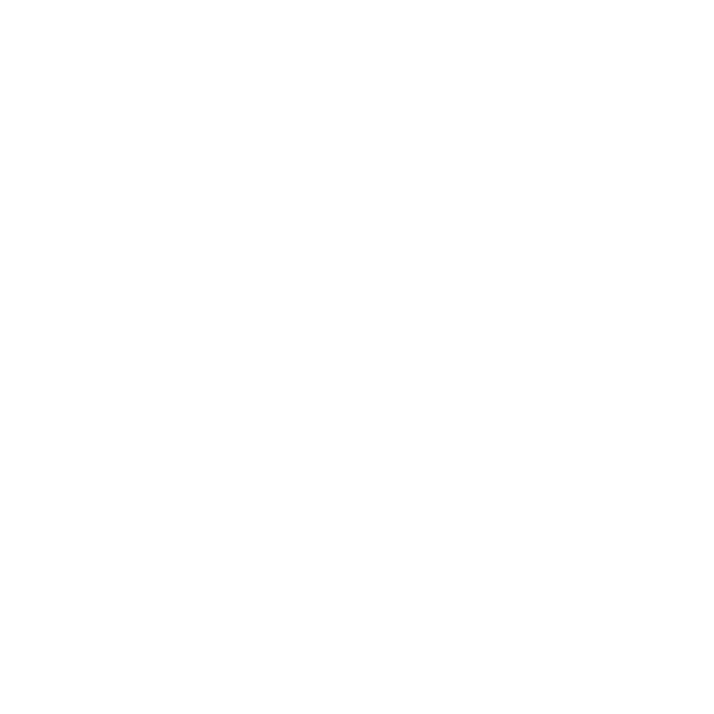

# VSPR - Visual Studio Pull Request Extension

  

VSPR (Visual Studio Pull Request) is an extension developed by me that streamlines the process of documenting pull requests for changes within a repository. With a single click, this extension utilizes generative AI to create comprehensive and detailed documentation for your pull requests.

## Features

- **One-Click PR Documentation**: Easily generate comprehensive pull request documentation with a single click.
- **Generative AI-powered**: Utilizes the power of generative AI to create detailed and informative PR documentation.
- **Streamlined Workflow**: Simplifies the process of documenting changes, saving time for developers.

## Installation

You can install the VSPR extension directly from the Visual Studio Code Marketplace or by following these steps:

1. Open Visual Studio Code.
2. Go to the Extensions view by clicking on the Extensions icon in the Activity Bar on the side of the window.
3. Search for "VSPR" in the Extensions view search box.
4. Click on the install button next to the "VSPR" extension offered by GS.
5. Once installed, reload Visual Studio Code to activate the extension.

## Usage

Using VSPR is simple:

1. Open Visual Studio Code and navigate to the sidebar.
2. Click on the Extensions icon located in the Activity Bar on the side of the window.
3. Look for the "VSPR" extension in the list of installed extensions.
4. Click on the "VSPR" extension to expand it.
5. Locate and click on the "Document Pull Request" button within the extension panel.

This streamlined approach allows for quick access and execution of the PR documentation process without utilizing the command palette.

<!-- Website: [gsprojects.com](https://gsprojects.com)
GitHub: [@GS](https://github.com/GS) -->
